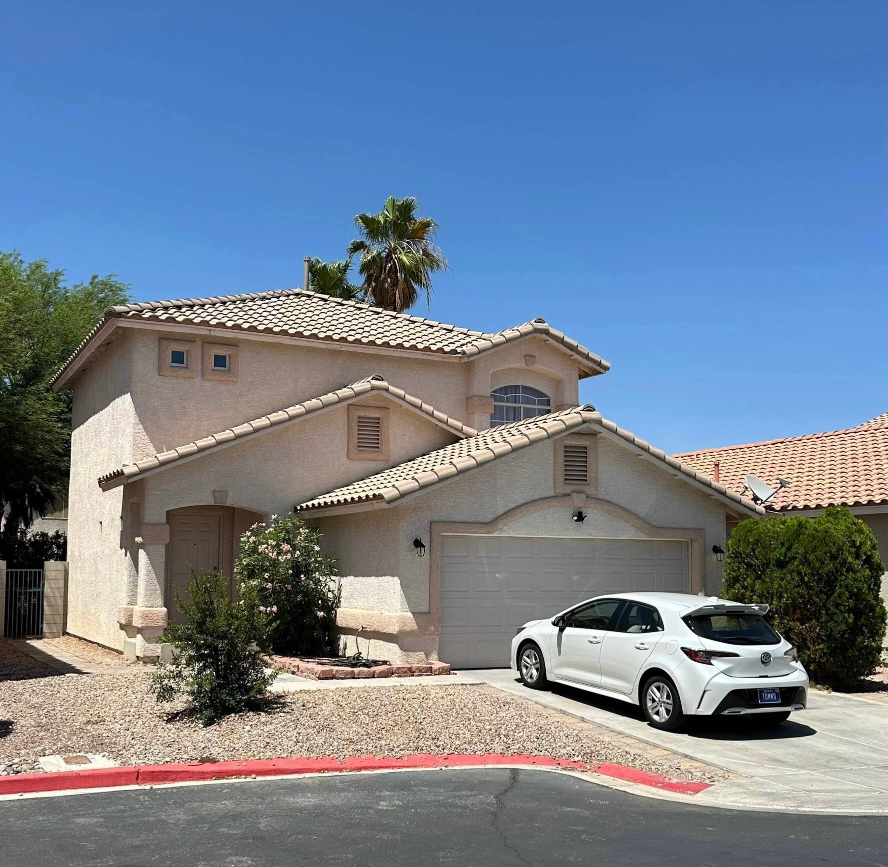

<h1>2025 Annual Net Worth Review</h1>

 
<Table :raw-spreadsheet-values="rawSpreadsheetValues" />

<h2>December 28, 2025</h2>

    2025 was an eventful year. Last year, I laid all the groundwork to make this year possible. I bought my first house just like I said I would, and I reached another significant milestone as well.
     
    This year, my stocks portfolio broke through $100k. Charlie Munger famously said that the first $100k is the most difficult but most important milestone in building wealth. That's because compound interest starts to really become noticeable after this mark. I'm thrilled to see how my investments grow from here on.
      
    You might've noticed I added a new row to the "Assets" category for precious metals. When seeing how uncontrollable the national debt has gotten, it's hard to have faith in the future of our economy. I decided to convert half of my emergency fund into silver. I figured in the rare case that I ever needed to dip into my emergency fund, I'd use the cash portion first, which is in a high-yield savings account, and I'd have time to sell the silver portion at a local coin shop.
     
    So far, my speculations have paid off. I bought 150oz of silver when spot price was around $40/oz, and we ended the year with it around $80. I don't think I'll buy any more for the foreseeable future. I plan on just holding what I've got. It's a bit comforting to have a chunk of wealth in physical form.
      
    Okay, getting back to the house purchase - I DID IT! I worked with a real estate agent to find houses that fit my criteria. After looking through dozens of listings on the MLS, and a handful of in-person tours, I eventually found a 2-bedroom house that was perfect for me.
  

  

    
  

  

    I received the keys to my house in June, just a couple of weeks before my 27th birthday. I started designing a tattoo to commemorate this day. I eventually came up with an ornate key with the number "25" to represent the year I bought my first house.
     
    I've been working towards this goal for so long that when I finally achieved it, I wanted to take it in for a little bit. However, I couldn't stay comfortable for too long; I had to find another goal to set. I signed a 30-year fixed rate mortgage, but I plan on paying it off way sooner than that. My next goal is to pay it off early. According to my projections, I should be able to pay off the loan in 12 years pretty easily. That's while still contributing to stock investments.
  

  

    
  

  

    A 12-year goal seems like a really long goal to set though. I need to find smaller milestones to strive for. Otherwise, I'll start to feel stagnant if there are no meaningful achievements within a long span of time. So with that, here are some shorter term goals I have.
     
    I want to reach coast FIRE within the next 4-6 years. This is when contributing to my stock portfolio is no longer efficient because majority of the growth will come from the compounding of my existing investments. At this point, I'll be able to ease off on monthly contributions and begin to put that money towards other things, such as upgrading the car or splurging on things I want.
     
    Another goal I have is to become a millionaire before I pay off the house. I'm not even a quarter way there yet, but I feel like it should be possible to reach a net worth of $1 million within the decade.
      
    I'm excited to see what the future holds. I feel like I'm finally starting to see things set in motion.
       
    - Tommy

    finance

<PrevNextButtons :prev="prev" />

