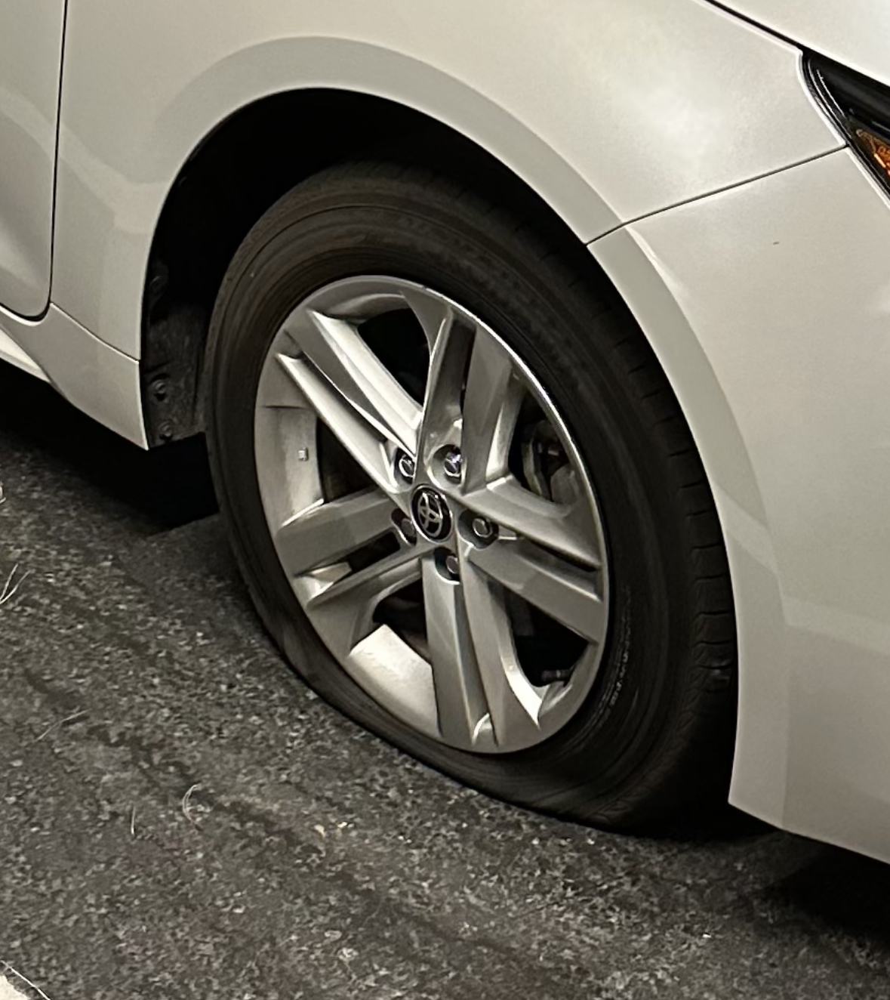

<h1>Having an emergency fund saved me</h1>

 

<h2>June 23, 2023</h2>

  If you're into personal finance, you've heard every money guru say the same thing - "You must have an emergency fund!"
   
  One of the first things every financial expert recommends for everyone is to set some money aside for a rainy day. Most of the time, the recommendation is 3-6 months of living expenses kept liquid in something like a high-yield savings account.

<blockquote>
  Because if there's one thing you can count on, it's that life will throw curveballs at you when you least expect it.
  </blockquote>

  If you're anything like me, then you hear these advices get thrown around so often that they almost become white noise. However, recently, I experienced an emergency that made be so grateful for my rainy-day reserve.
   
  I was on my way home from grocery shopping when all of a sudden, my front-right tire deflated like a Macy's parade float. And instead of being a source of stress in my week, since I had my emergency fund, it was barely an inconvenience to my evening. I was only a few blocks away, so I was able to make it home on the flat, then I just called a mobile tire service to literally come to my driveway and change my tire on the spot.
   
  Didn't have to worry about the cost at all. Highly recommend having that emergency fund.

  

  Over my next few paychecks, I'll simply replenish what was taken out of my high-yield savings account, and my emergency reserve will be fully funded once again.
     
  - Tommy

    monologue
    finance

